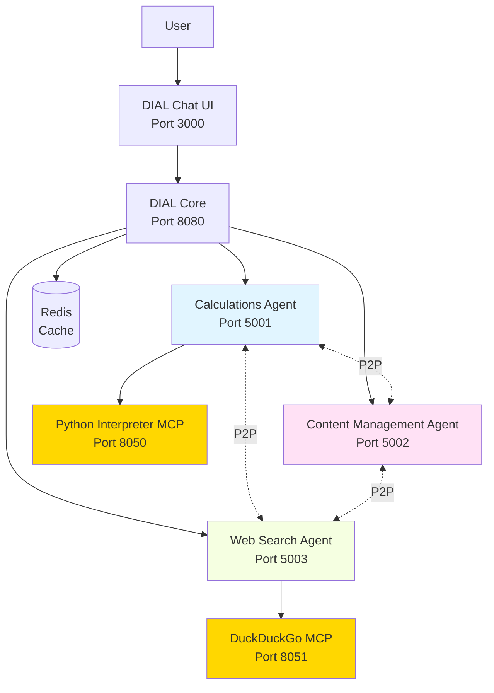

# AI DIAL Multi-Agent System (MAS) Mesh

## Overview

The **AI DIAL Multi-Agent System (MAS) Mesh** is a distributed network of three specialized AI agents that communicate peer-to-peer through the DIAL Unified Protocol (OpenAI-compatible). Each agent can call other agents as tools, creating a collaborative mesh architecture for complex task orchestration.

### Key Features

- **Peer-to-Peer Communication**: Agents call each other directly via DIAL Unified Protocol
- **Conversation Context Management**: Calling agents manage and propagate full conversation history
- **Specialized Agents**: Each agent has unique capabilities and can leverage others' expertise
- **Streaming Support**: Real-time response streaming with multi-level stage propagation
- **State Preservation**: P2P interaction history maintained per agent pair
- **MCP Integration**: Model Context Protocol for external tools (Python interpreter, web search)

## Quick Start

### Prerequisites

- Docker & Docker Compose
- Python 3.12+
- DIAL API Key

### Installation

```bash
# Clone the repository
git clone <repository-url>
cd ai-dial-mas-mesh

# Create and activate virtual environment
python3.12 -m venv dial_mas_mesh
source dial_mas_mesh/bin/activate

# Install dependencies
pip install -r requirements.txt

# Configure DIAL API key
# Edit core/config.json and add your key to gpt-4o.upstreams[0].key
```

### Running the System

```bash
# Start all services (DIAL Core, Chat UI, MCP servers, agents)
docker-compose up

# Access DIAL Chat UI
open http://localhost:3000
```

**Service Endpoints:**
- DIAL Chat UI: http://localhost:3000
- DIAL Core: http://localhost:8080
- Calculations Agent: http://localhost:5001
- Content Management Agent: http://localhost:5002
- Web Search Agent: http://localhost:5003
- Python Interpreter MCP: http://localhost:8050
- DuckDuckGo Search MCP: http://localhost:8051

## Architecture Overview



### Agent Capabilities

| Agent | Primary Function | Tools | Can Call |
|-------|-----------------|-------|----------|
| **Calculations** | Math operations, Python code execution, chart generation | SimpleCalculator, PythonInterpreter | ContentManagement, WebSearch |
| **Content Management** | File extraction (PDF/CSV/TXT), RAG search | FileExtractor, RAGTool | Calculations, WebSearch |
| **Web Search** | Web research via DuckDuckGo | DuckDuckGo MCP tools | Calculations, ContentManagement |

## Example Use Cases

### Weather Chart Generation
```
User → Calculations Agent: "I need a chart bar with weather forecast in Kyiv for the next 7 days"

Flow:
1. Calculations → WebSearch: Get weather data for Kyiv
2. WebSearch → Returns JSON with 7-day forecast
3. Calculations → PythonInterpreter: Generate Plotly bar chart
4. Returns chart visualization to user
```

### PDF Question Answering
```
User → Content Management Agent: "I need top 3 questions about Java memory model with answers" + [PDF attachment]

Flow:
1. ContentManagement → FileExtractor: Extract PDF content
2. ContentManagement → RAGTool: Semantic search for Java memory questions
3. Returns top 3 questions with answers from PDF
```

## Project Structure

```
ai-dial-mas-mesh/
├── task/                          # Main application code
│   ├── agents/                    # Agent implementations
│   │   ├── base_agent.py         # Base agent orchestration
│   │   ├── calculations/          # Calculations agent
│   │   ├── content_management/    # Content management agent
│   │   └── web_search/           # Web search agent
│   ├── tools/                     # Tool implementations
│   │   ├── base_tool.py          # Base tool pattern
│   │   ├── deployment/           # Agent tools (P2P communication)
│   │   └── mcp/                  # MCP tool wrapper
│   └── utils/                     # Utilities (history, stages, constants)
├── core/                          # DIAL Core configuration
│   └── config.json               # Agent & model configurations
├── settings/                      # Logging and settings
├── tests/                         # Test files
├── docs/                          # Documentation
├── docker-compose.yml            # Service orchestration
└── requirements.txt              # Python dependencies
```

## Documentation

- **[Architecture](./architecture.md)**: System design, data flow, architectural decisions
- **[Setup](./setup.md)**: Detailed environment setup and configuration
- **[API Reference](./api.md)**: Agent interfaces, tool schemas, message formats
- **[Testing](./testing.md)**: Test strategy and validation scenarios
- **[Glossary](./glossary.md)**: Domain terms and abbreviations
- **[ADRs](./adr/)**: Architecture Decision Records
- **[Roadmap](./roadmap.md)**: Future enhancements and milestones

## Key Concepts

### DIAL Unified Protocol
Applications expose `/chat/completions` endpoints following OpenAI-compatible protocol. Agents communicate like they communicate with AI models - the calling application provides full conversation context.

### Peer-to-Peer (P2P) History
Each agent maintains separate conversation histories with every other agent it calls. State is preserved in `custom_content.state` with agent-specific keys.

### Stage Propagation
Nested stages from called agents are propagated to calling agents, providing multi-level visibility into complex operations.

### Two Communication Modes
- **One-shot**: Single prompt sent to called agent
- **History Propagation**: Full P2P conversation context shared

## Contributing

See development guidelines in [setup.md](./setup.md#development-workflow).

## License

TODO: requires confirmation

## Support

For issues and questions, refer to:
- [Architecture documentation](./architecture.md)
- [API reference](./api.md)
- [Troubleshooting guide](./setup.md#troubleshooting)

---

*Last updated: 2025-12-31 | Version: 1.0.0*
