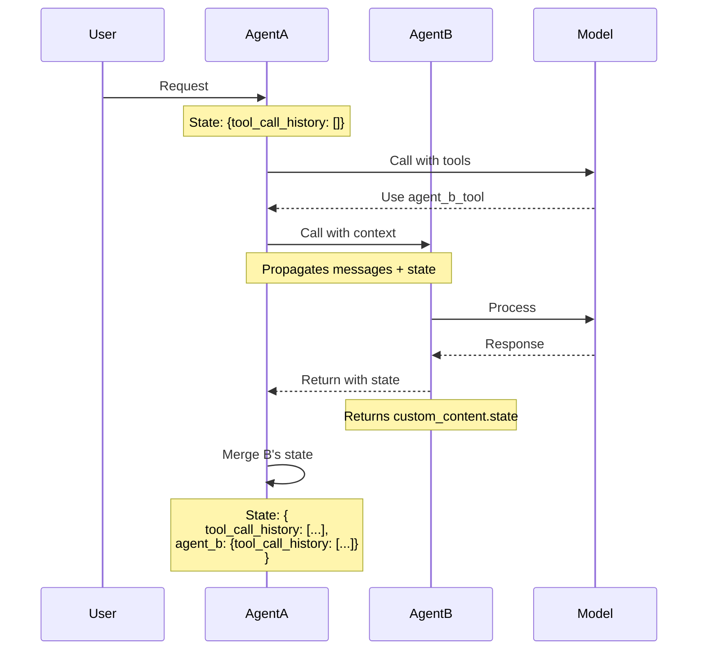

# ADR-003: State Management Strategy for P2P Agent Communication

## Status
**Accepted** - 2025-12-31

## Context

In a multi-agent mesh architecture, agents need to maintain conversation context when calling each other. We must decide how to manage state across agent boundaries while keeping agents stateless.

### Problem Statement

- Agents should be stateless for scalability
- P2P conversations need history preservation
- Context must be manageable (not grow unbounded)
- Clear ownership of conversation state required
- History must be queryable and debuggable

### Key Questions

1. Where is state stored?
2. Who owns the conversation context?
3. How is P2P history structured?
4. When is history propagated vs. one-shot?
5. How do we prevent unbounded growth?

## Decision

Implement **Caller-Managed State** with **Nested P2P History** stored in message `custom_content.state`.

### Architecture

**Principle**: The calling agent owns and manages conversation context.



### State Structure

```json
{
  "custom_content": {
    "state": {
      "tool_call_history": [
        {"role": "assistant", "tool_calls": [...]},
        {"role": "tool", "content": "...", "tool_call_id": "..."}
      ],
      "web_search_agent": {
        "tool_call_history": [
          // P2P history with Web Search Agent
        ]
      },
      "content_management_agent": {
        "tool_call_history": [
          // P2P history with Content Management Agent
        ]
      }
    }
  }
}
```

## Rationale

### Design Principles

**1. Stateless Agents**
```python
class BaseAgent:
    def __init__(self, endpoint, system_prompt, tools):
        # No persistent state storage
        self.state = {TOOL_CALL_HISTORY_KEY: []}  # Reinitialized per request
```

- Agents don't persist state between requests
- State passed in every request message
- Horizontal scaling without shared state
- Restart-safe (no state loss)

**2. Caller Responsibility**
```python
# Calling agent prepares full context
messages = self._prepare_messages(tool_call_params)
if propagate_history:
    # Extract P2P history from state
    # Include previous interactions with this agent
    ...
```

- Calling agent provides conversation history
- Called agent receives complete context
- No coordination between agents required
- Clear ownership model

**3. Hierarchical State Organization**

```
state/
├── tool_call_history       # This agent's tool calls
├── agent_a/                # P2P with Agent A
│   └── tool_call_history
├── agent_b/                # P2P with Agent B
│   └── tool_call_history
└── agent_c/                # P2P with Agent C
    └── tool_call_history
```

Benefits:
- Isolated P2P histories
- No cross-contamination
- Easy to query specific agent interactions
- Clear debugging path

**4. Two Propagation Modes**

```python
# Mode 1: One-shot (propagate_history=false)
messages = [{"role": "user", "content": prompt}]

# Mode 2: Full P2P history (propagate_history=true)
messages = [
    previous_user_msg,
    previous_assistant_msg_with_p2p_state,
    {"role": "user", "content": prompt}
]
```

- One-shot: Fresh context each call
- P2P history: Continuous conversation
- Agent decides which mode to use
- Controlled context growth

## Implementation

### State Storage (BaseAgent)

```python
class BaseAgent:
    def __init__(self, ...):
        self.state: dict[str, Any] = {
            TOOL_CALL_HISTORY_KEY: []
        }
    
    async def handle_request(self, ...):
        # Process request
        ...
        # Execute tool calls
        tool_messages = await self._process_tool_calls(...)
        
        # Save to state
        self.state[TOOL_CALL_HISTORY_KEY].append(assistant_message.dict())
        self.state[TOOL_CALL_HISTORY_KEY].extend(tool_messages)
        
        # Recursive call with updated state
        return await self.handle_request(...)
```

### State Propagation (BaseAgentTool)

```python
def _prepare_messages(self, tool_call_params):
    messages = []
    
    if propagate_history:
        for message in tool_call_params.messages:
            if message.role == Role.ASSISTANT:
                if message.custom_content and message.custom_content.state:
                    state = message.custom_content.state
                    
                    # Extract P2P history for this agent
                    if self.name in state:
                        # Add user message (context)
                        messages.append(previous_user_message)
                        
                        # Add assistant message with refactored state
                        assistant_copy = deepcopy(message)
                        assistant_copy.custom_content.state = state[self.name]
                        messages.append(assistant_copy.dict())
    
    # Add current prompt
    messages.append({"role": "user", "content": prompt})
    return messages
```

### State Collection (BaseAgentTool)

```python
async def _execute(self, tool_call_params):
    # Call agent, collect response
    ...
    
    # Return with state
    return Message(
        role=Role.TOOL,
        content=content,
        tool_call_id=tool_call_params.tool_call.id,
        custom_content=CustomContent(
            state=collected_state_from_response
        )
    )
```

### State Gathering (BaseAgent)

```python
def _gather_tool_history_to_state(self, tool_name, tool_message):
    if tool_message.custom_content and tool_message.custom_content.state:
        # Extract P2P history from tool response
        agent_history = tool_message.custom_content.state.get(TOOL_CALL_HISTORY_KEY)
        
        if agent_history:
            # Store under agent name key
            if self.state.get(tool_name):
                self.state[tool_name].extend(agent_history)
            else:
                self.state[tool_name] = {
                    TOOL_CALL_HISTORY_KEY: agent_history
                }
```

## Trade-offs

### Advantages

✅ **Stateless Agents**: Easy to scale horizontally  
✅ **Clear Ownership**: Calling agent manages context  
✅ **Isolated Histories**: P2P histories don't interfere  
✅ **Flexible Modes**: One-shot or history propagation  
✅ **Debuggable**: State visible in message trace  
✅ **Restart-Safe**: No external state store needed

### Disadvantages

❌ **Context Size Growth**: State grows with interactions  
  *Mitigation: Future history compression*

❌ **Serialization Overhead**: State in every message  
  *Acceptable: JSON serialization is fast*

❌ **No Cross-Agent Coordination**: Can't easily share state between unrelated agents  
  *Acceptable: Not a current requirement*

❌ **Deepcopy Required**: State refactoring requires deepcopy  
  *Acceptable: Small performance cost*

## Alternatives Considered

### 1. External State Store (Redis/Database)

**Pros:**
- Unbounded history storage
- Queryable across agents
- Shared state possible

**Cons:**
- Agents become stateful
- Coordination complexity
- External dependency
- Horizontal scaling harder

**Why Rejected:** Violates stateless principle

### 2. Flat State Structure

```json
{
  "all_tool_calls": [
    {"agent": "web_search", "call": {...}},
    {"agent": "calculations", "call": {...}}
  ]
}
```

**Pros:**
- Simpler structure
- Easier to iterate all calls

**Cons:**
- No P2P isolation
- Harder to extract agent-specific history
- Cross-agent contamination risk

**Why Rejected:** Hierarchical structure more maintainable

### 3. State in Request Headers

```
X-Conversation-State: base64_encoded_state
```

**Pros:**
- Separate from message content
- Standard HTTP mechanism

**Cons:**
- Header size limits
- Not part of OpenAI standard
- Harder to debug
- Lost if headers stripped

**Why Rejected:** custom_content provides better solution

### 4. Event Sourcing

**Pros:**
- Complete audit trail
- Time travel debugging
- Reproducible state

**Cons:**
- Complex implementation
- Requires event store
- Over-engineering for current needs

**Why Rejected:** Too complex for requirements

## Consequences

### Positive

- Agents can scale independently
- Clear debugging path (state in messages)
- P2P histories cleanly separated
- No external dependencies for state
- Easy to understand ownership model

### Negative

- Context size can grow large
  - Plan: Implement compression in v1.3
- State structure can become complex
  - Mitigated: Clear documentation, helper functions
- No easy way to share state across unrelated agents
  - Acceptable: Not needed currently

### Future Enhancements

**v1.3: History Compression**
```python
def compress_history(state):
    """Summarize old P2P history to reduce context size."""
    if len(state[agent_name]["tool_call_history"]) > THRESHOLD:
        # Summarize old interactions
        # Keep recent interactions full
        ...
```

**v2.0: State Snapshots**
```python
# Optional: Save snapshots for long conversations
snapshot = {
    "conversation_id": "...",
    "checkpoint": 42,
    "state": {...}
}
# Restore from checkpoint if needed
```

## Validation

### Success Criteria

- [x] State structure follows specified format
- [x] P2P histories isolated per agent
- [x] One-shot mode sends only prompt
- [x] History propagation mode includes P2P context
- [x] State visible in message traces
- [x] Agents remain stateless (no persistence)

### Monitoring

```python
# Log state size for monitoring
state_size = len(json.dumps(self.state))
if state_size > 50000:  # 50KB
    logger.warning(f"Large state detected: {state_size} bytes")
```

### Debug Helpers

```python
def debug_state(state):
    """Print human-readable state structure."""
    print("Current Agent History:", len(state["tool_call_history"]))
    for agent_name, agent_state in state.items():
        if agent_name != "tool_call_history":
            print(f"{agent_name}: {len(agent_state['tool_call_history'])} interactions")
```

## References

- [OpenAI custom_content Extension](https://docs.epam-rail.com/custom-content)
- [Stateless Architecture Patterns](https://microservices.io/patterns/data/stateless-service.html)
- [task/utils/history.py](../../task/utils/history.py) - Implementation
- [task/agents/base_agent.py](../../task/agents/base_agent.py) - State management

## Notes

- State management is critical for debugging and tracing
- Consider compression before context window becomes limiting
- Monitor state sizes in production
- Document state structure changes carefully

---

*Status: Accepted | Last Updated: 2025-12-31*
