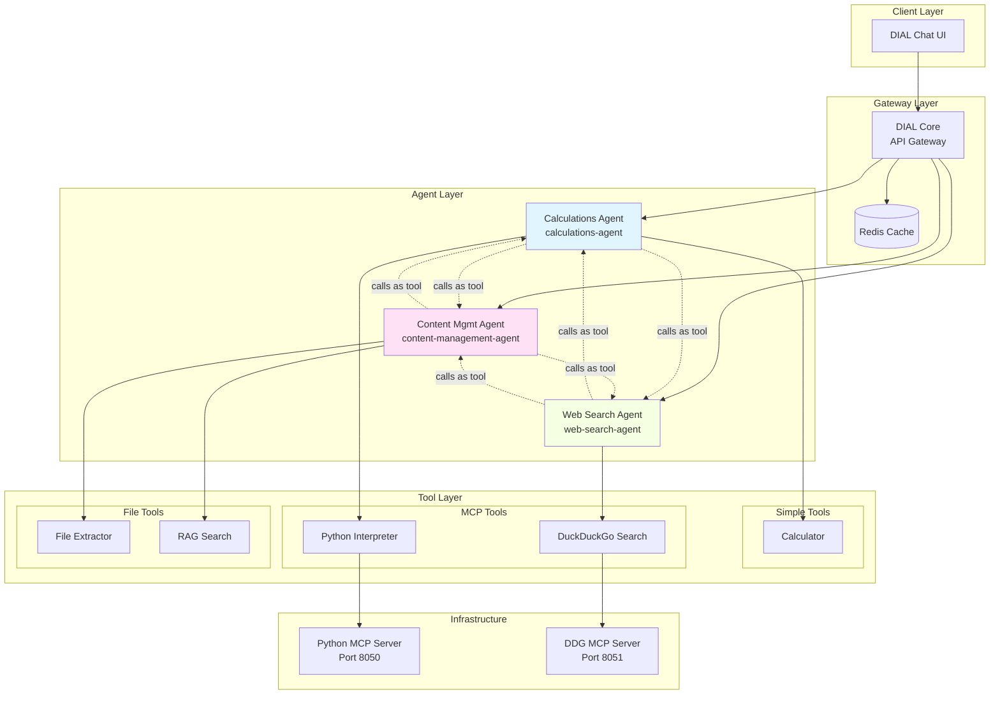
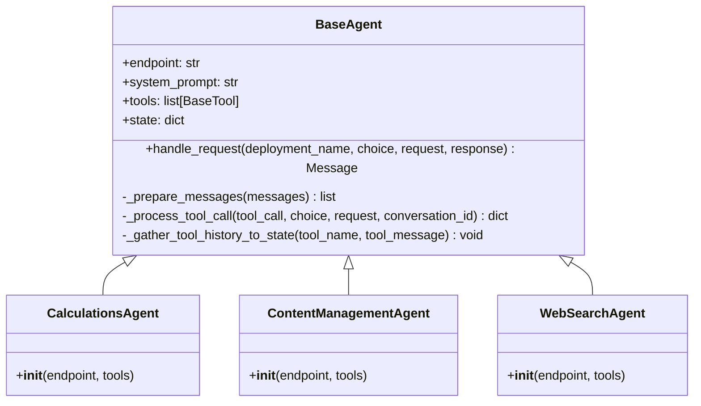
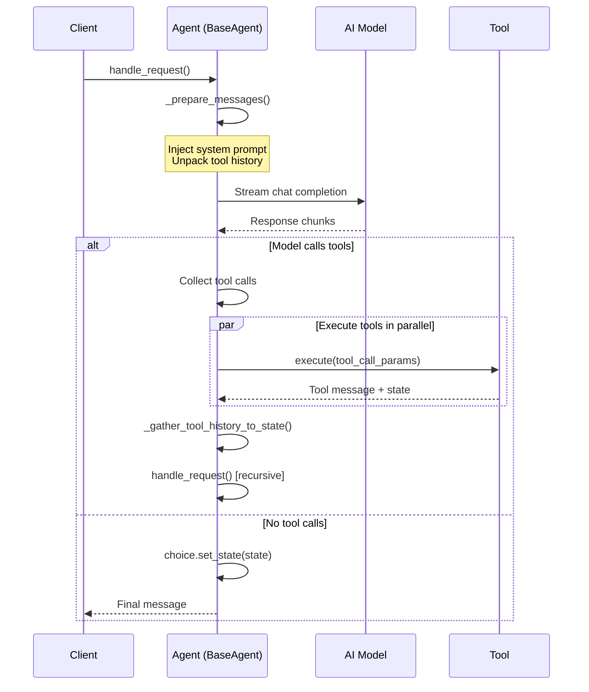
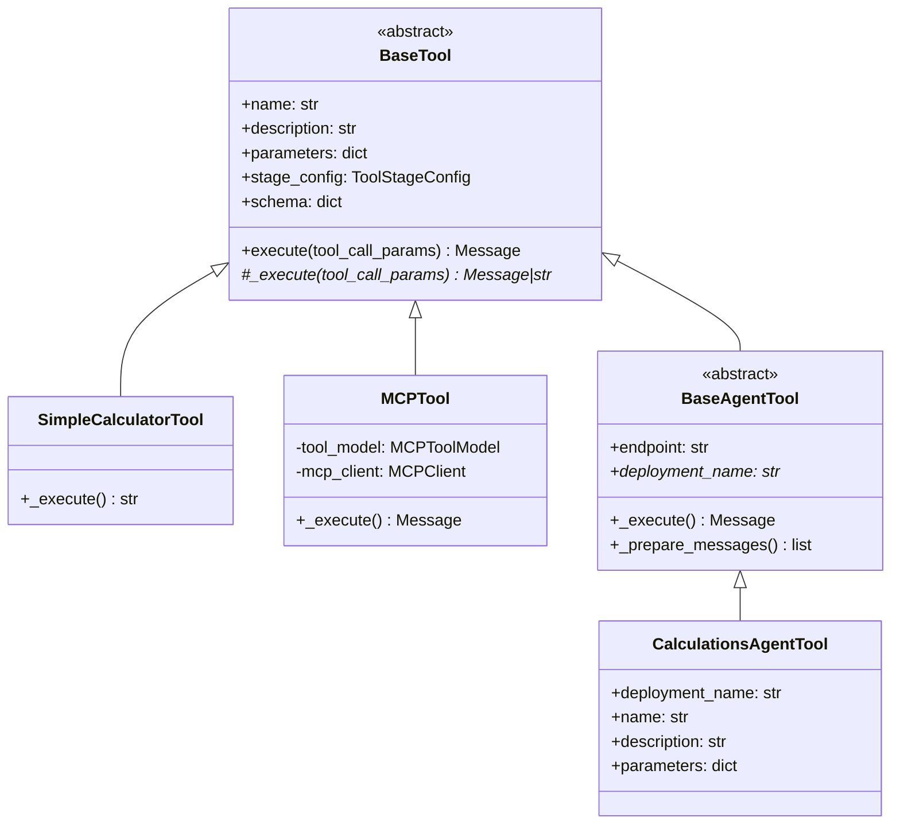
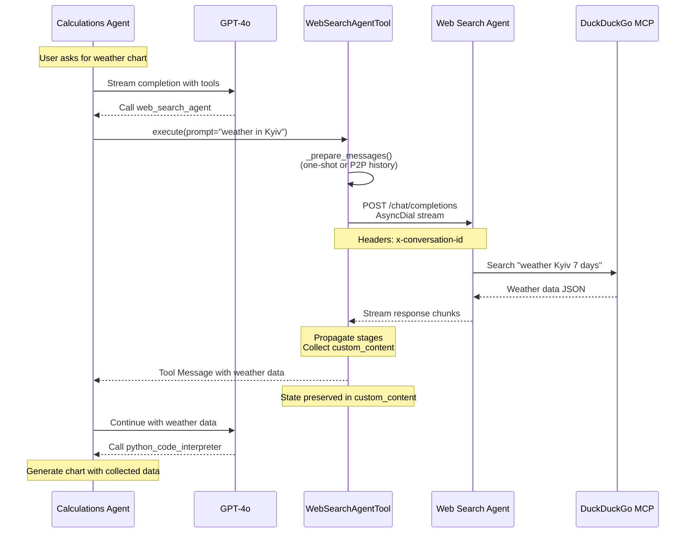
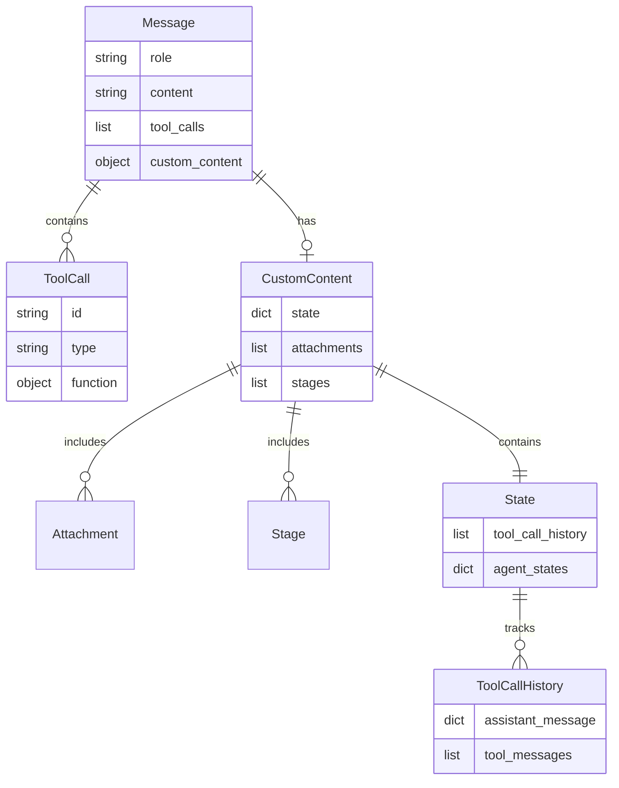
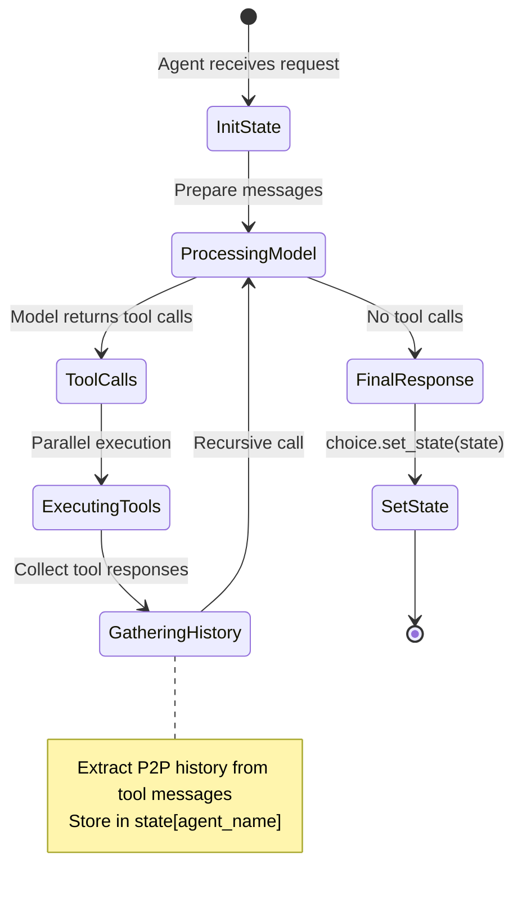
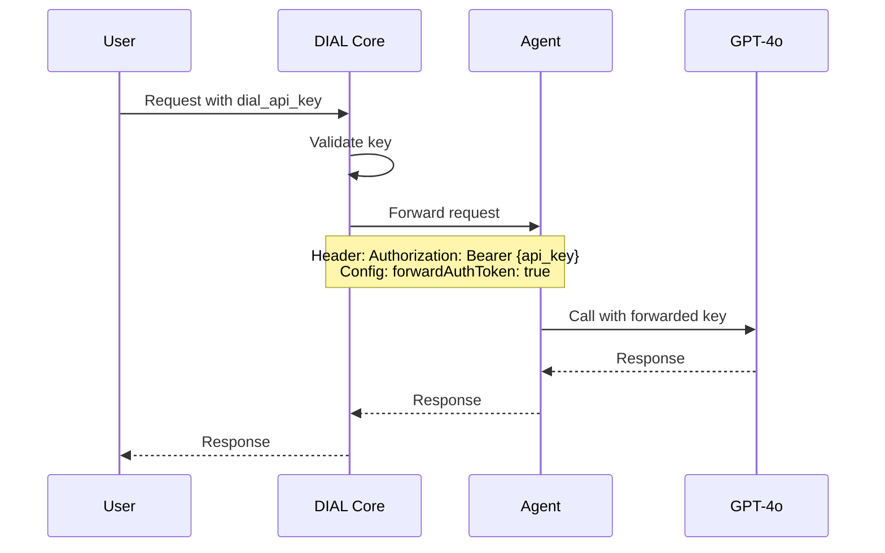

# System Architecture

## Table of Contents
- [Overview](#overview)
- [Architecture Principles](#architecture-principles)
- [System Components](#system-components)
- [Agent Architecture](#agent-architecture)
- [Communication Flow](#communication-flow)
- [Data Models](#data-models)
- [State Management](#state-management)
- [Deployment Architecture](#deployment-architecture)
- [Security Considerations](#security-considerations)

## Overview

The AI DIAL MAS Mesh implements a **peer-to-peer multi-agent architecture** where specialized agents collaborate through direct communication. The system leverages the DIAL Unified Protocol to enable agent-to-agent calls that mirror standard AI model API interactions.

### Core Architectural Principle

**DIAL's Unified Protocol**: Applications communicate through OpenAI-compatible `/chat/completions` endpoints. The calling application provides and manages the full conversation context, enabling stateless agent design with stateful interactions.

## Architecture Principles

1. **Separation of Concerns**: Each agent specializes in a specific domain
2. **Protocol Unification**: All communication follows OpenAI-compatible patterns
3. **Context Ownership**: Calling agent manages conversation history
4. **Stateless Agents**: Agents don't persist state; context passed in each request
5. **Tool Abstraction**: Common tool interface for simple tools, MCP tools, and agent tools
6. **Streaming First**: Real-time response streaming with progress visibility

## System Components

### High-Level Architecture



### Component Descriptions

#### DIAL Core
- **Purpose**: API gateway and request router
- **Port**: 8080
- **Responsibilities**:
  - Route requests to appropriate agents/models
  - Handle authentication and API keys
  - Manage Redis caching
  - Forward auth tokens to agents

#### Agents (Application Layer)
Each agent runs as a standalone AIDIAL application:

| Agent | Port | Deployment Name | File |
|-------|------|----------------|------|
| Calculations | 5001 | `calculations-agent` | [calculations_app.py](../task/agents/calculations/calculations_app.py) |
| Content Management | 5002 | `content-management-agent` | [content_management_app.py](../task/agents/content_management/content_management_app.py) |
| Web Search | 5003 | `web-search-agent` | [web_search_app.py](../task/agents/web_search/web_search_app.py) |

#### MCP Servers
External tool providers using Model Context Protocol:

- **Python Interpreter** (Port 8050): Code execution, file generation
- **DuckDuckGo Search** (Port 8051): Web search capabilities

## Agent Architecture

### Base Agent Pattern

All agents extend [BaseAgent](../task/agents/base_agent.py) which provides:



### Agent Request Flow



### Tool Architecture



## Communication Flow

### Agent-to-Agent Communication



### Message Format

Agent-to-agent calls use standard OpenAI format:

```json
{
  "messages": [
    {
      "role": "user",
      "content": "Get weather forecast for Kyiv",
      "custom_content": {
        "attachments": []
      }
    }
  ],
  "tools": [...],
  "stream": true
}
```

### Response Format

Agents return streaming chunks with custom_content:

```json
{
  "choices": [{
    "delta": {
      "content": "Here is the weather...",
      "custom_content": {
        "state": {
          "tool_call_history": [...]
        },
        "attachments": [...],
        "stages": [...]
      }
    }
  }]
}
```

## Data Models

### Core Data Structures



### State Structure

P2P history preserved in assistant message state:

```json
{
  "state": {
    "tool_call_history": [
      {"role": "assistant", "tool_calls": [...]},
      {"role": "tool", "content": "...", "tool_call_id": "..."}
    ],
    "web_search_agent": {
      "tool_call_history": [...]
    },
    "content_management_agent": {
      "tool_call_history": [...]
    }
  }
}
```

## State Management

### State Lifecycle



### History Management

See [task/utils/history.py](../task/utils/history.py) for implementation:

- **`unpack_messages()`**: Flattens nested tool call history from assistant messages
- Appends attachment URLs to user message content
- Removes custom_content when sending to model (models don't understand custom fields)

## Deployment Architecture

### Docker Compose Services

```mermaid
graph TB
    subgraph "Frontend"
        UI[Chat UI<br/>:3000]
        Themes[Themes<br/>:3001]
    end
    
    subgraph "Backend"
        Core[DIAL Core<br/>:8080]
        Adapter[DIAL Adapter<br/>:5000]
    end
    
    subgraph "Agents - Host Machine"
        CA[Calculations<br/>:5001]
        CMA[Content Mgmt<br/>:5002]
        WSA[Web Search<br/>:5003]
    end
    
    subgraph "MCP Servers"
        PyMCP[Python MCP<br/>:8050]
        DdgMCP[DDG MCP<br/>:8051]
    end
    
    subgraph "Storage"
        Redis[(Redis<br/>:6379)]
        Insight[Redis Insight<br/>:6380]
    end
    
    UI --> Themes
    UI --> Core
    Core --> Adapter
    Core --> Redis
    Core -.http://host.docker.internal.-> CA
    Core -.http://host.docker.internal.-> CMA
    Core -.http://host.docker.internal.-> WSA
    
    CA --> PyMCP
    WSA --> DdgMCP
```

### Network Configuration

- **Docker Network**: Containers communicate via service names
- **Host Access**: Agents use `host.docker.internal` to communicate from Docker to host machine
- **Port Mapping**: All services expose specific ports for external access

## Security Considerations

### Authentication Flow



### Security Measures

1. **API Key Forwarding**: `forwardAuthToken: true` in agent configs
2. **Redis Security**: In-memory cache with TTL, no persistence
3. **Network Isolation**: Docker network isolation
4. **No Secrets in Code**: Environment variables and config files

### Input Validation

- **File Type Restrictions**: `inputAttachmentTypes` limits supported formats
- **Parameter Validation**: Pydantic models enforce schema
- **Content Extraction**: Sandboxed file processing

## Performance Considerations

### Optimization Strategies

1. **Parallel Tool Execution**: `asyncio.gather()` for concurrent tool calls
2. **Streaming Responses**: Real-time chunk delivery reduces perceived latency
3. **Redis Caching**: DIAL Core caches responses
4. **Stage Management**: Progressive disclosure of long-running operations

### Resource Limits

Configured in docker-compose.yml:
- Python MCP: 2G memory, 2 CPUs
- DDG MCP: 512M memory, 0.5 CPUs
- Redis: 2200M max memory

## Architectural Decisions

See [ADR directory](./adr/) for detailed records:

- [ADR-001: Mesh Architecture Selection](./adr/ADR-001-mesh-architecture.md)
- [ADR-002: DIAL Unified Protocol](./adr/ADR-002-dial-unified-protocol.md)
- [ADR-003: State Management Strategy](./adr/ADR-003-state-management.md)
- [ADR-004: Tool Abstraction Pattern](./adr/ADR-004-tool-abstraction.md)

## Future Enhancements

See [roadmap.md](./roadmap.md) for planned improvements:

- Dynamic agent discovery
- Enhanced P2P history compression
- Agent capability negotiation
- Multi-modal content support

---

*Last updated: 2025-12-31 | Version: 1.0.0*
