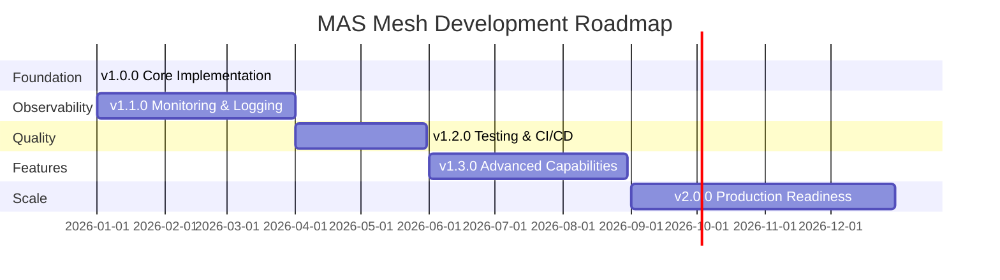

# Roadmap

## Current Status (v1.0.0)

### ✅ Completed Features

- **Core Agent Implementation**
  - Calculations Agent with Python interpreter and calculator
  - Content Management Agent with file extraction and RAG
  - Web Search Agent with DuckDuckGo integration
  
- **P2P Communication**
  - Agent-to-agent tool calls via DIAL Unified Protocol
  - Context propagation with history management
  - Stage propagation for multi-level visibility
  
- **Infrastructure**
  - Docker Compose orchestration
  - MCP server integration
  - DIAL Core configuration
  - Chat UI integration

- **Documentation**
  - Architecture documentation
  - Setup guides
  - API reference
  - Testing scenarios

## Upcoming Releases

### v1.1.0 - Enhanced Observability (Q1 2026)

**Goal**: Improve monitoring, logging, and debugging capabilities

**Features:**
- [ ] Structured logging with correlation IDs
- [ ] Agent interaction visualization dashboard
- [ ] Performance metrics collection (Prometheus/Grafana)
- [ ] Distributed tracing (OpenTelemetry)
- [ ] Real-time conversation monitoring UI

**Success Criteria:**
- Full request tracing across agent calls
- Performance bottlenecks identified automatically
- Debug logs searchable by conversation ID

### v1.2.0 - Testing & Quality (Q2 2026)

**Goal**: Establish comprehensive test coverage

**Features:**
- [ ] Unit test suite (80%+ coverage)
- [ ] Integration test framework
- [ ] Automated E2E test scenarios
- [ ] Performance benchmarking suite
- [ ] CI/CD pipeline with automated testing

**Success Criteria:**
- All manual test scenarios automated
- Test execution time < 5 minutes
- Coverage reports generated automatically

### v1.3.0 - Advanced Features (Q2 2026)

**Goal**: Enhance agent capabilities and user experience

**Features:**
- [ ] Multi-modal support (images, audio)
- [ ] Enhanced RAG with citation tracking
- [ ] Code execution sandbox improvements
- [ ] Custom agent creation wizard
- [ ] Agent capability discovery API

**Success Criteria:**
- Agents handle image inputs correctly
- RAG citations link to exact document locations
- Users can create custom agents via UI

## Future Enhancements

### Advanced Communication

**Dynamic Agent Discovery**
- Agents register capabilities dynamically
- Runtime discovery of available agents
- Capability-based routing

**History Compression**
- Intelligent summary of P2P histories
- Reduce context size for long conversations
- Maintain key information while compressing

**Agent Capability Negotiation**
- Agents negotiate task distribution
- Cost-based routing (faster/cheaper agents)
- Quality-of-service preferences

### Scalability Improvements

**Horizontal Scaling**
- Multiple instances of each agent type
- Load balancing across agent instances
- Agent pool management

**Caching Layer**
- Cache common agent responses
- Invalidation strategies
- Distributed cache coordination

**Async Processing**
- Long-running task queue
- Background job processing
- Status polling endpoints

### Security Enhancements

**Fine-grained Access Control**
- Role-based agent access
- Tool-level permissions
- API rate limiting per user

**Audit Logging**
- Complete audit trail of agent actions
- Compliance reporting
- Data access tracking

**Input Validation**
- Enhanced file type checking
- Content sanitization
- Malicious input detection

### Developer Experience

**Agent Development Kit**
```python
from mas_mesh import AgentBuilder

# Simplified agent creation
agent = AgentBuilder("my-agent") \
    .with_tools([CustomTool(), ExternalAPI()]) \
    .with_prompt("You are a specialized agent for...") \
    .with_capabilities(["search", "analyze"]) \
    .build()
```

**Testing Framework**
```python
from mas_mesh.testing import AgentTest

class TestMyAgent(AgentTest):
    agent = "my-agent"
    
    def test_basic_interaction(self):
        response = self.call_agent("Calculate 2+2")
        self.assertEqual(response.content, "4")
```

**Local Development Mode**
- Mock external services for offline development
- Fast agent reload without Docker restart
- Interactive debugging tools

## Research & Exploration

### Potential Investigations

**Agent Learning**
- Agents learn from successful interactions
- Improve P2P communication patterns
- Optimize tool selection

**Autonomous Agents**
- Agents initiate actions proactively
- Background monitoring and alerts
- Scheduled task execution

**Multi-Agent Consensus**
- Multiple agents vote on answers
- Conflict resolution strategies
- Confidence scoring

**Hybrid Architecture**
- Combine mesh with hierarchical for complex tasks
- Dynamic topology based on workload
- Meta-agent for coordination

## Backlog

### High Priority

1. **Error Recovery Mechanisms**
   - Automatic retry with exponential backoff
   - Fallback agents for critical tools
   - Graceful degradation strategies

2. **Performance Optimization**
   - Response caching
   - Connection pooling
   - Database query optimization

3. **Documentation Improvements**
   - Video tutorials
   - Interactive examples
   - API playground

### Medium Priority

1. **Additional Agent Types**
   - Database Query Agent
   - Image Generation Agent
   - Translation Agent
   - Code Review Agent

2. **Tool Marketplace**
   - Community-contributed tools
   - Tool discovery and installation
   - Version management

3. **Conversation Management**
   - Save/load conversations
   - Conversation templates
   - Shared conversations

### Low Priority

1. **UI Customization**
   - Themeable chat interface
   - Custom branding
   - Layout preferences

2. **Internationalization**
   - Multi-language UI
   - Translated system prompts
   - Localized error messages

3. **Analytics Dashboard**
   - Usage statistics
   - Popular agent combinations
   - Cost tracking

## Risk Register

| Risk | Probability | Impact | Mitigation |
|------|------------|--------|------------|
| P2P history grows too large | Medium | High | Implement history compression in v1.3 |
| Circular agent calls | Low | High | Add cycle detection, conversation limits |
| MCP server downtime | Medium | Medium | Implement health checks, fallback mechanisms |
| Context window exhaustion | Medium | High | Summarization, history management |
| Agent response quality degradation | Low | Medium | Continuous monitoring, prompt optimization |

## Milestones



## Contributing

We welcome contributions! Priority areas:

1. **Testing**: Help us achieve 80%+ coverage
2. **Documentation**: Improve guides and examples
3. **Tools**: Create new tools for agents
4. **Agents**: Develop specialized agents
5. **MCP Servers**: Integrate additional MCP tools

See [CONTRIBUTING.md] (TODO) for guidelines.

## Feedback

Share your ideas and feedback:
- GitHub Issues: Feature requests and bugs
- Discussions: Architecture and design questions
- Slack/Discord: TODO: Create community channels

## Success Metrics

### v1.x Series Goals

- **Adoption**: 10+ production deployments
- **Performance**: < 5s average response time
- **Reliability**: 99.9% uptime
- **Quality**: Zero critical bugs in production
- **Community**: 50+ contributors

### v2.x Series Goals

- **Scale**: Support 100+ concurrent users per agent
- **Extensibility**: 20+ agent types available
- **Integration**: 50+ MCP tools integrated
- **Documentation**: Comprehensive guides for all features

---

*Last updated: 2025-12-31 | Version: 1.0.0 | Next Review: Q1 2026*
