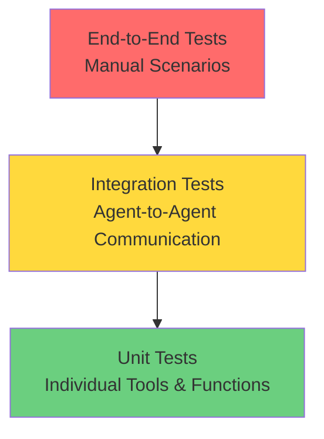
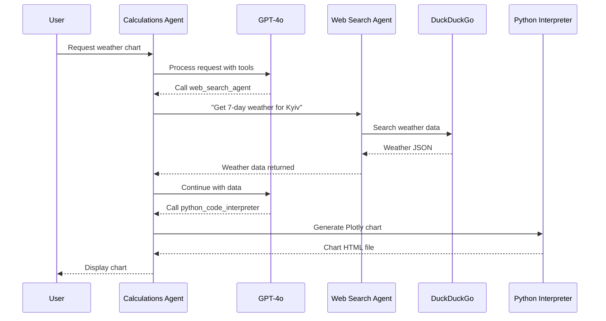
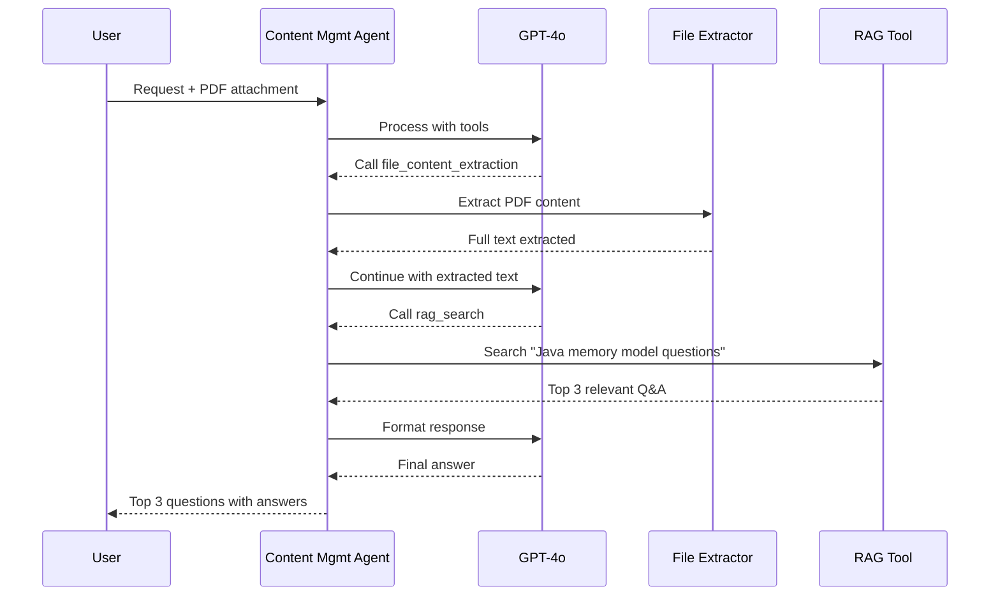

# Testing Guide

## Table of Contents
- [Testing Strategy](#testing-strategy)
- [Test Scenarios](#test-scenarios)
- [Manual Testing](#manual-testing)
- [Integration Testing](#integration-testing)
- [Performance Testing](#performance-testing)

## Testing Strategy

### Test Pyramid



### Testing Objectives

1. **Functional Correctness**: Verify each agent performs its designated tasks
2. **P2P Communication**: Validate agent-to-agent calls and history propagation
3. **Error Handling**: Ensure graceful degradation and error messages
4. **Performance**: Validate response times and resource usage
5. **Integration**: Test end-to-end workflows across multiple agents

### Test Coverage Goals

| Component | Target Coverage | Current Status |
|-----------|----------------|----------------|
| Agent Classes | 80%+ | TODO: requires confirmation |
| Tool Implementations | 90%+ | TODO: requires confirmation |
| Utility Functions | 95%+ | TODO: requires confirmation |
| Integration Scenarios | 100% | Manual testing required |

## Test Scenarios

### Scenario 1: Weather Chart Generation

**Objective**: Test Calculations → Web Search → Calculations workflow

**User Request:**
```
"I need a chart bar with weather forecast in Kyiv for the next 7 days"
```

**Expected Flow:**



**Validation Checklist:**
- [ ] Calculations Agent receives request
- [ ] Model decides to call Web Search Agent
- [ ] Web Search Agent performs search via DuckDuckGo
- [ ] Weather data returned to Calculations Agent
- [ ] Python code generated to create chart
- [ ] Plotly bar chart created with 7 days
- [ ] Chart attachment returned to user
- [ ] P2P history preserved in state

**Test Steps:**

1. Start all services
2. Access DIAL Chat UI (http://localhost:3000)
3. Select "Calculations Agent"
4. Enter prompt: "I need a chart bar with weather forecast in Kyiv for the next 7 days"
5. Observe agent interactions in stages
6. Verify chart is generated and displayed

**Success Criteria:**
- Response contains Plotly bar chart
- Chart shows 7 days of weather data
- No errors in console logs
- Stages show clear progression

### Scenario 2: PDF Question Answering

**Objective**: Test Content Management file extraction and RAG

**User Request:**
```
"I need top 3 questions about Java memory model with answers"
+ Attach: tests/java-questions-150.pdf
```

**Expected Flow:**



**Validation Checklist:**
- [ ] PDF attachment uploaded successfully
- [ ] File content extracted completely
- [ ] Pagination handled if needed
- [ ] RAG search finds relevant questions
- [ ] Top 3 questions returned with answers
- [ ] Answers are accurate from PDF content

**Test Steps:**

1. Access DIAL Chat UI
2. Select "Content Management Agent"
3. Attach file: `tests/java-questions-150.pdf`
4. Enter prompt: "I need top 3 questions about Java memory model with answers"
5. Observe extraction and RAG stages
6. Verify response quality

**Success Criteria:**
- 3 questions about Java memory model returned
- Each question has detailed answer
- Answers match PDF content
- No extraction errors

### Scenario 3: Cross-Agent Collaboration

**Objective**: Test complex multi-agent workflow

**User Request:**
```
"Research Python async programming best practices and create a comparison chart of asyncio vs threads performance"
```

**Expected Flow:**
1. Calculations Agent receives request
2. Calls Web Search Agent for research
3. Web Search returns articles and benchmarks
4. Calculations Agent processes data
5. Calls Python Interpreter to create comparison chart
6. Returns chart with citations

**Validation Checklist:**
- [ ] Multi-agent collaboration works
- [ ] Information flows between agents
- [ ] Final output combines research + visualization
- [ ] Sources cited properly

### Scenario 4: P2P History Propagation

**Objective**: Validate history propagation mode

**Test Setup:**

```python
# First call (one-shot)
calculations_agent_tool_call = {
    "function": {
        "name": "call_web_search_agent",
        "arguments": '{"prompt": "Latest AI news", "propagate_history": false}'
    }
}

# Second call (with history)
calculations_agent_tool_call = {
    "function": {
        "name": "call_web_search_agent",
        "arguments": '{"prompt": "More details on topic X", "propagate_history": true}'
    }
}
```

**Validation:**
- First call: Only prompt sent, no context
- Second call: Previous interaction included
- State structure preserves P2P history

### Scenario 5: Error Handling

**Objective**: Test graceful error handling

**Test Cases:**

| Error Condition | Expected Behavior |
|----------------|-------------------|
| Invalid API key | 401 error, clear message |
| MCP server down | Tool error, fallback suggested |
| Invalid tool parameters | Validation error, schema shown |
| File not found | Clear error message |
| Large file timeout | Pagination offered |
| Model rate limit | Retry with backoff |

**Test Steps:**
```bash
# Test with invalid API key
# Edit core/config.json, set invalid key
# Expected: 401 Unauthorized error

# Test with MCP server down
docker-compose stop python-interpreter-mcp-server
# Call Calculations Agent with Python code
# Expected: MCP connection error, graceful message

# Test with malformed tool call
# Call with missing required parameter
# Expected: Parameter validation error
```

## Manual Testing

### Pre-Test Setup

```bash
# 1. Ensure all services running
docker-compose ps

# 2. Verify agent health
curl http://localhost:5001/health  # Calculations
curl http://localhost:5002/health  # Content Management
curl http://localhost:5003/health  # Web Search

# 3. Check MCP servers
curl http://localhost:8050/health  # Python Interpreter
curl http://localhost:8051/health  # DuckDuckGo

# 4. Access Chat UI
open http://localhost:3000
```

### Test Execution Checklist

For each test scenario:

- [ ] Clear browser cache/cookies
- [ ] Start new conversation
- [ ] Select correct agent
- [ ] Enter test prompt exactly as documented
- [ ] Observe stage progression
- [ ] Check console for errors
- [ ] Verify final output
- [ ] Document any issues
- [ ] Check agent logs

### Test Data

| File | Location | Purpose |
|------|----------|---------|
| java-questions-150.pdf | [tests/](../tests/java-questions-150.pdf) | PDF extraction testing |
| microwave_manual.txt | [tests/](../tests/microwave_manual.txt) | TXT file testing |
| report.csv | [tests/](../tests/report.csv) | CSV file testing |

## Integration Testing

### Agent Communication Test

```python
# TODO: Create automated integration test

async def test_agent_to_agent_communication():
    """Test Calculations Agent calling Web Search Agent."""
    
    # Setup
    async with AsyncDial(
        base_url="http://localhost:8080",
        api_key="dial_api_key",
        api_version='2025-01-01-preview'
    ) as client:
        # Call Calculations Agent
        stream = await client.chat_completions_stream(
            deployment_id="calculations-agent",
            messages=[
                {"role": "user", "content": "Search for Python tutorials"}
            ]
        )
        
        # Validate response
        content = ""
        async for chunk in stream:
            if chunk.choices[0].delta.content:
                content += chunk.choices[0].delta.content
        
        # Assertions
        assert "python" in content.lower()
        assert len(content) > 0
```

### Tool Execution Test

```python
# TODO: Create tool-specific tests

def test_simple_calculator():
    """Test simple calculator tool."""
    tool = SimpleCalculatorTool()
    
    # Test addition
    result = tool.execute(ToolCallParams(
        tool_call=ToolCall(
            id="test_1",
            function={"name": "simple_calculator", "arguments": '{"a": 5, "b": 3, "operation": "add"}'}
        ),
        stage=mock_stage,
        choice=mock_choice,
        api_key="test_key",
        conversation_id="test_conv",
        messages=[]
    ))
    
    assert result.content == "8"
```

## Performance Testing

### Response Time Benchmarks

| Operation | Target | Actual | Status |
|-----------|--------|--------|--------|
| Simple calculation | < 2s | TODO | - |
| Python code execution | < 10s | TODO | - |
| File extraction (1MB PDF) | < 5s | TODO | - |
| RAG search | < 3s | TODO | - |
| Agent-to-agent call | < 5s | TODO | - |
| Weather chart generation | < 30s | TODO | - |

### Load Testing

```bash
# TODO: Create load test script

# Simulate concurrent users
for i in {1..10}; do
  curl -X POST http://localhost:8080/openai/deployments/calculations-agent/chat/completions \
    -H "Authorization: Bearer dial_api_key" \
    -H "Content-Type: application/json" \
    -d '{
      "messages": [{"role": "user", "content": "Calculate 2+2"}],
      "stream": false
    }' &
done
wait
```

### Resource Monitoring

```bash
# Monitor Docker container resources
docker stats

# Check memory usage
docker stats --no-stream --format "table {{.Container}}\t{{.MemUsage}}"

# Check CPU usage
docker stats --no-stream --format "table {{.Container}}\t{{.CPUPerc}}"
```

## Test Automation

### Continuous Testing (Future)

```yaml
# TODO: Create CI/CD pipeline

name: Test MAS Mesh
on: [push, pull_request]

jobs:
  test:
    runs-on: ubuntu-latest
    steps:
      - uses: actions/checkout@v2
      - name: Set up Python
        uses: actions/setup-python@v2
        with:
          python-version: '3.12'
      - name: Install dependencies
        run: pip install -r requirements.txt
      - name: Run unit tests
        run: pytest tests/unit/
      - name: Start services
        run: docker-compose up -d
      - name: Run integration tests
        run: pytest tests/integration/
      - name: Run E2E tests
        run: pytest tests/e2e/
```

## Quality Gates

### Definition of Done

For each feature:
- [ ] Unit tests pass
- [ ] Integration tests pass
- [ ] Manual test scenarios validated
- [ ] No critical errors in logs
- [ ] Performance benchmarks met
- [ ] Documentation updated
- [ ] Code review completed

### Bug Tracking

| Severity | Response Time | Resolution Time |
|----------|--------------|-----------------|
| Critical | Immediate | 24 hours |
| High | 4 hours | 3 days |
| Medium | 1 day | 1 week |
| Low | 1 week | As prioritized |

## Test Environment

### Local Development
- Docker Compose with all services
- Local Python agents (hot reload)
- DIAL Chat UI on localhost:3000

### Staging (Future)
- TODO: Deploy to staging environment
- TODO: Configure with test API keys
- TODO: Set up monitoring and alerts

## Known Issues

| Issue | Impact | Workaround | Status |
|-------|--------|------------|--------|
| TODO | - | - | - |

---

*Last updated: 2025-12-31 | Version: 1.0.0*
